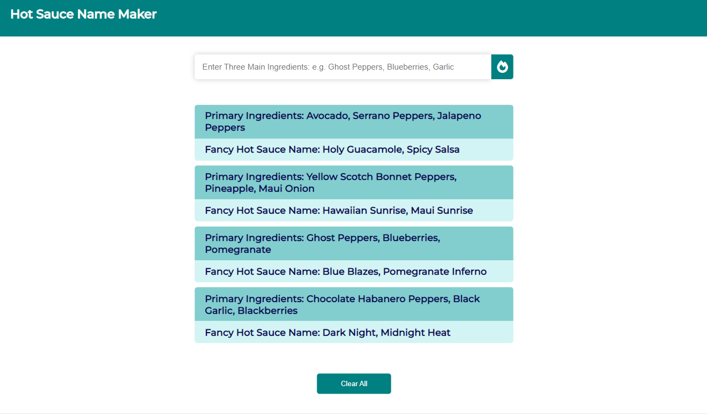

# Hot Sauce Name Maker



> Hot Sauce Name Maker Application with React, OpenAI API, and Node.js.

---

### Table of Contents

- [Description](#description)
- [How To Use](#how-to-use)
- [License](#license)

---

## Description

This application allows a user to enter a list of primary ingredients from their unique hot sauce recipe as a text prompt. Submitting the input sends the prompt to the OpenAI API, which returns a list of unique names for the product based on the provided ingredients. 

The application uses localStorage to save the user's list of unique hot sauce names, and a proxy server to facilitate requests to OpenAI API.


#### Technologies

- React : v18.1.0
- Node.js : v16.14.2
- Express.js: v4.18.1
- CSS3

---

## How To Use

#### Fork and Clone Repository

```
git clone https://github.com/amehi0index/react-openai.git
```
#### Sign-up for your own API Key at : 

https://openai.com/api/


#### Install dependencies for server
```
npm install
```

#### Run the server

```
npm run dev
```

---

## License

This project is licensed under the [MIT License](#LICENSE.txt)

Copyright (c) 2022 [Amelia Hill](#https://ameliahill.com)

[Back To Top](#hot-sauce-name-maker)